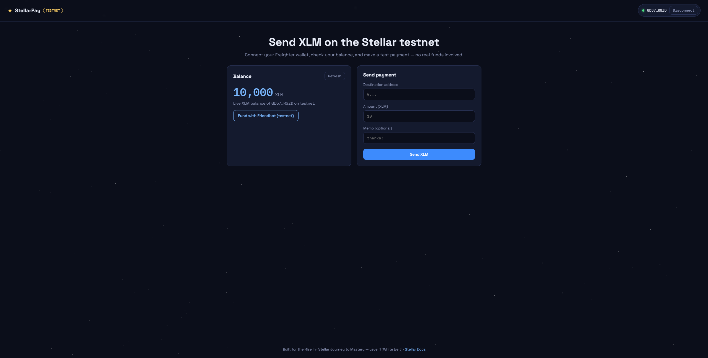
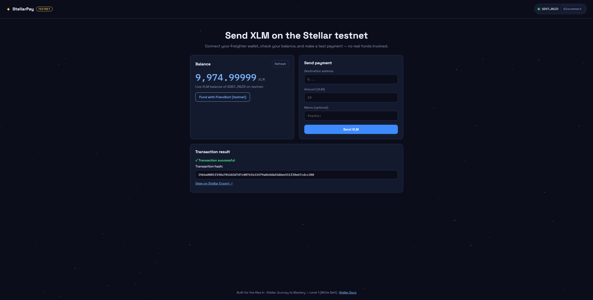

# StellarPay — Simple Payment dApp (Stellar Testnet)

**Level 1 – White Belt submission · Rise In × Stellar "Journey to Mastery"**

StellarPay is a simple payment dApp built on the **Stellar testnet**. It lets you connect a [Freighter](https://www.freighter.app) wallet, view your live XLM balance, fund your account with Friendbot, and send XLM payments to any address — with clear success/failure feedback and the transaction hash.

## ✨ Features

- **Wallet connection** — Connect and disconnect the Freighter wallet (session is restored automatically if already authorized)
- **Network check** — Warns you if Freighter is not set to Testnet
- **Balance display** — Fetches the connected wallet's live XLM balance from Horizon and shows it in the UI
- **Friendbot funding** — One-click testnet XLM funding for unfunded accounts
- **Send XLM** — Payment form with destination, amount, and optional memo
  - Automatically uses `createAccount` instead of `payment` if the destination doesn't exist yet on testnet
  - Input validation (address format, amount > 0, self-payment check)
- **Transaction feedback** — Pending / success / failure states, the transaction hash, and a direct link to the transaction on [Stellar Expert](https://stellar.expert/explorer/testnet)
- **Error handling** — Horizon result codes (e.g. `op_underfunded`) are surfaced to the user

## 🛠 Tech Stack

- Plain **HTML / CSS / JavaScript** (no build step)
- [`stellar-sdk`](https://github.com/stellar/js-stellar-sdk) (browser bundle via CDN) — transaction building & submission
- [`@stellar/freighter-api`](https://docs.freighter.app/) (browser bundle via CDN) — wallet connection & signing
- **Horizon testnet** REST API — account & balance data
- **Friendbot** — testnet funding

## 🚀 Setup — Run Locally

### Prerequisites

1. Install the [Freighter browser extension](https://www.freighter.app/)
2. Create/import a wallet in Freighter and switch the network to **Test Net**
   (Freighter → network dropdown at the top → *Test Net*)

### Run

Because browser extensions don't inject into `file://` pages, serve the folder with any static server:

```bash
# clone the repo
git clone https://github.com/<your-username>/stellar-payment-dapp.git
cd stellar-payment-dapp

# option 1 — Python
python3 -m http.server 8000

# option 2 — Node
npx serve .
```

Then open **http://localhost:8000** in the browser where Freighter is installed.

### Usage

1. Click **Connect Freighter** and approve the request in the extension
2. If your balance is `0` / account not found, click **Fund with Friendbot** to get 10,000 test XLM
3. Enter a destination address (`G...`) and an amount, then click **Send XLM**
4. Approve the transaction in Freighter — the result (success/failure + tx hash) appears at the bottom

> Tip: to test a payment, you can create a second account in Freighter and use its address as the destination.

## 📸 Screenshots

### Wallet connected state


### Balance displayed


### Successful testnet transaction (shown to the user)


## 📁 Project Structure

```
├── index.html   # UI layout
├── style.css    # Styling
├── app.js       # Wallet connection, balance fetch, transaction logic
└── screenshots/ # README screenshots
```

## ✅ Level 1 Requirements Coverage

| Requirement | Status |
|---|---|
| Freighter wallet setup (Testnet) | ✅ |
| Wallet connect / disconnect | ✅ |
| Fetch & display XLM balance | ✅ |
| Send XLM transaction on testnet | ✅ |
| Success/failure feedback + tx hash | ✅ |
| Error handling | ✅ |
| Public GitHub repo + README | ✅ |
